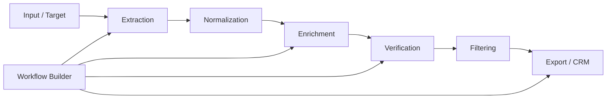

# Riletto

### Lead Intelligence / Email Marketing Platform — Architecture Case Study

Riletto is an all-in-one lead-intelligence and email-marketing platform. It combines extraction, enrichment, verification, filtering, formatting, workflow automation, CRM/API integration and payments.

A central part of the product is a custom node-based workflow system where tools can operate as nodes and pass structured data between processing stages.

The production application is private. This repository documents the engineering approach without exposing proprietary source code.

## Product Architecture



## Core Stack

**Runtime:** Node.js, TypeScript, JavaScript  
**Frontend:** Next.js, React, Tailwind CSS  
**Browser automation:** Puppeteer, Playwright  
**Data:** PostgreSQL, Supabase, Redis  
**State:** TanStack React Query, Zustand  
**AI:** Gemini  
**Payments:** Stripe, Flutterwave  
**Infrastructure:** Vercel, Cloudflare

## Processing Pipeline

```text
Input
  ↓
Extraction
  ↓
Normalization
  ↓
Deduplication
  ↓
Enrichment
  ↓
Verification
  ↓
Filtering
  ↓
Export / CRM
```

The production system contains additional business-specific rules that are intentionally omitted here.

## Engineering Challenges

### Long-running browser work

Browser automation and multi-stage processing can exceed normal request lifecycles. The processing model therefore separates expensive work from ordinary HTTP request handling.

### Workflow execution

The visual workflow builder represents tools as nodes connected by data flow. Node configuration is kept separate from runtime execution state so the interface can remain responsive while processing occurs.

### Data normalization

Lead sources can produce inconsistent structures. Normalization is performed before downstream enrichment and verification so later stages operate on predictable data.

### Progress and state synchronization

Long-running jobs need progress information to reach the interface without manual page refreshes. Server-state caching and realtime updates are used where appropriate.

## Engineering Principles

- Keep browser automation outside normal request handling when work is long-running.
- Normalize data before enrichment and verification.
- Treat external services as failure-prone boundaries.
- Separate server state from local UI state.
- Keep proprietary business logic outside public repositories.

## Private Production Code

The production Riletto repository is private because it contains proprietary application logic and infrastructure. This repository demonstrates the architecture and engineering reasoning behind the product.

